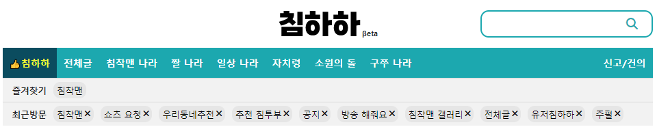

# Chimhaha
* * *

침하하 홈페이지 데이터를 수집하여 분석하는 프로젝트

## 1. Ideas
침하하 게시판의 게시글과 유저들을 분석해보자

## 2. Dataset
아래의 게시판들의 정보를 웹스크래핑을 통해 수집한다
- 소원의돌: https://chimhaha.net/check
- 자치령
- 침착맨 게시판: https://chimhaha.net/stream_free

## 3. How-to
1. 웹스크래핑을 통해 데이서 수집
2. pandas, numpy 등을 통해 EDA
3. data studio를 통해 데시보드 작성

## 4. Result
- 침하하 소원의돌 12월 분석: https://chimhaha.net/stream_free/111031
- 침하하 자치령 12월 분석: https://chimhaha.net/stream_free/111031
- 침하하 침착맨 게시판 12월 분석: https://chimhaha.net/stream_free/120546

## 5. Reference
- https://wikidocs.net/87477